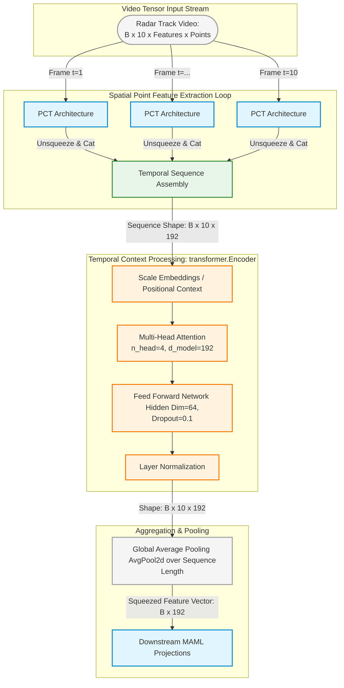

Looking closely at your `main.py` code from earlier, your architecture actually utilizes only the standalone `encoder.Encoder` module from this framework for temporal aggregation (with `vocab_size=None` and `d_model=192`), bypassing the full sequence-to-sequence `Decoder` and target masking blocks shown in this file.

To give a complete picture on your EUSIPCO poster of how spatial feature extraction feeds into temporal processing, it is highly effective to show how these frames step sequentially through time.

---

### Diagram: The Joint Spatial-Temporal Pipeline (PCT + Encoder)

This diagram illustrates how frame-wise video slices are mapped via your spatial PCT modules into a sequence of feature vectors, which are then passed into the Transformer Encoder block for temporal tracking context.

---

### 📌 Poster Formatting Tip for Reviewers

When describing the temporal step in your paper's methodology text, make sure to explicitly mention that **the decoder and casual triangular autoregressive masks are discarded**.

Because your tracking-integrated ISAR task evaluates complete macro-trajectories to classify a target identity, using a **bidirectional encoder-only self-attention layout** allows every frame in the tracking window to capture context from both past and future frames simultaneously. This provides a significantly more robust temporal embedding than standard autoregressive sequence modeling.