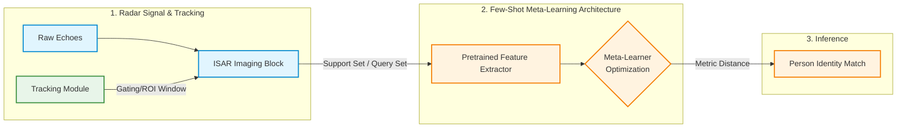
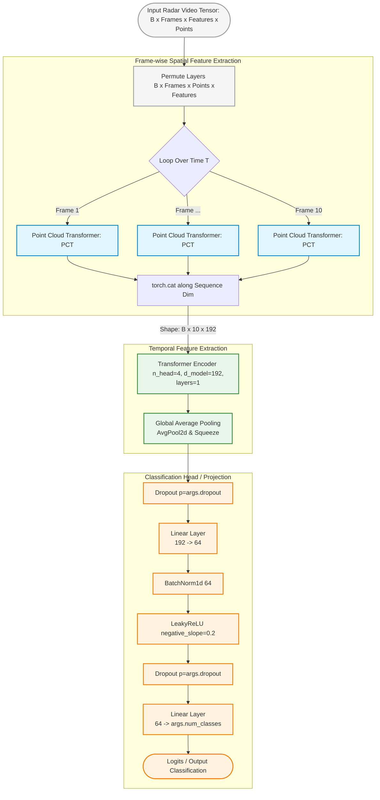
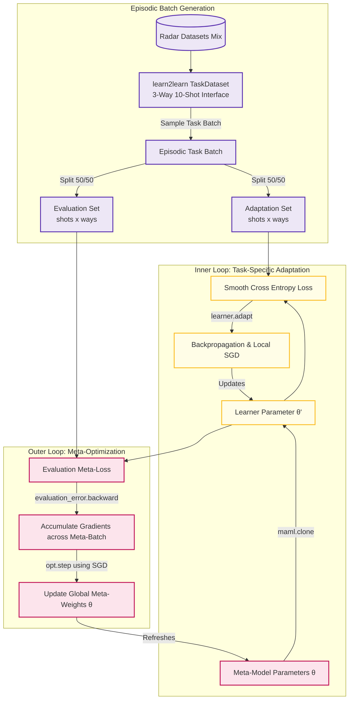
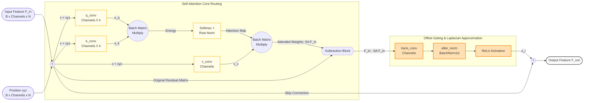

```mermaid

graph LR
    %% Styles
    classDef signal fill:#e1f5fe,stroke:#0288d1,stroke-width:2px;
    classDef track fill:#e8f5e9,stroke:#388e3c,stroke-width:2px;
    classDef ml fill:#fff3e0,stroke:#f57c00,stroke-width:2px;
    
    subgraph SP [1. Radar Signal & Tracking]
        Raw[Raw Echoes]:::signal --> ISAR[ISAR Imaging Block]:::signal
        Track[Tracking Module]:::track -->|Gating/ROI Window| ISAR
    end

    subgraph Meta [2. Few-Shot Meta-Learning Architecture]
        ISAR -->|Support Set / Query Set| FE[Pretrained Feature Extractor]:::ml
        FE --> MetLoop{Meta-Learner \n Optimization}:::ml
    end

    subgraph Out [3. Inference]
        MetLoop -->|Metric Distance| ID[Person Identity Match]:::ml
    end

```

```mermaid

graph TD
    %% Styling
    classDef input fill:#f5f5f5,stroke:#9e9e9e,stroke-width:2px;
    classDef spatial fill:#e1f5fe,stroke:#0288d1,stroke-width:2px;
    classDef temporal fill:#e8f5e9,stroke:#388e3c,stroke-width:2px;
    classDef dense fill:#fff3e0,stroke:#f57c00,stroke-width:2px;

    In([Input Radar Video Tensor: <br/> B x Frames x Features x Points]):::input --> Perm[Permute Layers <br/> B x Frames x Points x Features]:::input
    
    subgraph SpatialBlock [Frame-wise Spatial Feature Extraction]
        Perm --> Split{Loop Over Time T}
        Split -->|Frame 1| PCT1[Point Cloud Transformer: PCT]:::spatial
        Split -->|Frame ...| PCTi[Point Cloud Transformer: PCT]:::spatial
        Split -->|Frame 10| PCT10[Point Cloud Transformer: PCT]:::spatial
        
        PCT1 --> Cat[torch.cat along Sequence Dim]
        PCTi --> Cat
        PCT10 --> Cat
    end

    subgraph TemporalBlock [Temporal Feature Extraction]
        Cat -->|Shape: B x 10 x 192| TransEncoder[Transformer Encoder <br/> n_head=4, d_model=192, layers=1]:::temporal
        TransEncoder --> AvgPool[Global Average Pooling <br/> AvgPool2d & Squeeze]:::temporal
    end

    subgraph Classifier [Classification Head / Projection]
        AvgPool --> DP1[Dropout p=args.dropout]:::dense
        DP1 --> Lin2[Linear Layer <br/> 192 -> 64]:::dense
        Lin2 --> BN7[BatchNorm1d 64]:::dense
        BN7 --> Act[LeakyReLU negative_slope=0.2]:::dense
        Act --> DP2[Dropout p=args.dropout]:::dense
        DP2 --> Lin3[Linear Layer <br/> 64 -> args.num_classes]:::dense
        Lin3 --> Out([Logits / Output Classification]):::dense
    end
```

```mermaid

graph TD
    %% Styling
    classDef data fill:#ede7f6,stroke:#5e35b1,stroke-width:2px;
    classDef inner fill:#fffde7,stroke:#fbc02d,stroke-width:2px;
    classDef outer fill:#fce4ec,stroke:#c2185b,stroke-width:2px;

    subgraph TaskGen [Episodic Batch Generation]
        RawData[(Radar Datasets Mix)]:::data --> TaskSets[learn2learn TaskDataset <br/> 3-Way 10-Shot Interface]:::data
        TaskSets -->|Sample Task Batch| Batch[Episodic Task Batch]:::data
        Batch -->|Split 50/50| Support[Adaptation Set <br/> shots x ways]:::data
        Batch -->|Split 50/50| Query[Evaluation Set <br/> shots x ways]:::data
    end

    subgraph InnerLoop [Inner Loop: Task-Specific Adaptation]
        InitWeights[Meta-Model Parameters θ]:::outer -->|maml.clone| Clone[Learner Parameter θ']:::inner
        Support --> CrossEnt1[Smooth Cross Entropy Loss]:::inner
        Clone --> CrossEnt1
        CrossEnt1 -->|learner.adapt| GradUpdate[Backpropagation & Local SGD]:::inner
        GradUpdate -->|Updates| Clone
    end

    subgraph OuterLoop [Outer Loop: Meta-Optimization]
        Query --> CrossEnt2[Evaluation Meta-Loss]:::outer
        Clone --> CrossEnt2
        CrossEnt2 -->|evaluation_error.backward| AccumGrads[Accumulate Gradients across Meta-Batch]:::outer
        AccumGrads -->|opt.step using SGD| MetaUpdate[Update Global Meta-Weights θ]:::outer
        MetaUpdate -->|Refreshes| InitWeights
    end

```

```mermaid
graph TD
    %% Styling
    classDef io fill:#f5f5f5,stroke:#9e9e9e,stroke-width:2px;
    classDef embedding fill:#e1f5fe,stroke:#0288d1,stroke-width:2px;
    classDef local fill:#e8f5e9,stroke:#388e3c,stroke-width:2px;
    classDef attention fill:#fff3e0,stroke:#f57c00,stroke-width:2px;
    classDef head fill:#fce4ec,stroke:#c2185b,stroke-width:2px;

    In([Input Frame Frame Tensor <br/> B x Points x 3]):::io --> Conv1[Conv1d 3 -> 64 <br/> BN1 + ReLU]:::embedding
    Conv1 --> Conv2[Conv1d 64 -> 64 <br/> BN2 + ReLU]:::embedding
    
    subgraph NeighborEmbed [Hierarchical Neighbor Embedding Stage]
        Conv2 -->|Permute & Sample| SG1[sample_and_group <br/> npoint=150, radius=0.1]:::local
        SG1 --> LocOp1[Local_op 0 <br/> in=128 -> out=128]:::local
        LocOp1 -->|Permute & Sample| SG2[sample_and_group <br/> npoint=75, radius=0.1]:::local
        SG2 --> LocOp2[Local_op 1 <br/> in=256 -> out=256]:::local
    end

    subgraph AttnStage [Point Transformer Last Stage]
        LocOp2 -->|feature_1| PTLast[Point_Transformer_Last]:::attention
        PTLast -->|Concatenated SAs <br/> Shape: B x 1024 x N| Cat[torch.cat with feature_1]:::attention
        Cat -->|Shape: B x 1280 x N| ConvFuse[conv_fuse <br/> Conv1d 1280 -> 1024 + BN + LeakyReLU]:::attention
    end

    subgraph OutputDecoder [Feature Aggregation & Decoder]
        ConvFuse --> MaxPool[Adaptive Max Pooling 1D]:::head
        MaxPool -->|Flatten: B x 1024| Lin1[Linear 1024 -> 512 <br/> BN + LeakyReLU + Dropout]:::head
        Lin1 --> Lin2[Linear 512 -> 192 <br/> BN + LeakyReLU + Dropout]:::head
        Lin2 --> Lin3[Linear 192 -> output_channels 192 -> 7]:::head
        Lin3 --> Out([Output Local Frame Representation]):::io
    end
```

```mermaid

graph LR
    %% Styling
    classDef tensor fill:#fafafa,stroke:#616161,stroke-width:2px;
    classDef op fill:#fffde7,stroke:#fbc02d,stroke-width:2px;
    classDef gate fill:#ffe0b2,stroke:#f57c00,stroke-width:2px;

    Fin([Input Feature F_in <br/> B x Channels x N]) --> AddPos((+))
    Fxyz([Position xyz <br/> B x Channels x N]) --> AddPos
    
    subgraph AttnCore [Self-Attention Core Routing]
        AddPos -->|x + xyz| QConv[q_conv <br/> Channels // 4]:::op
        AddPos -->|x + xyz| KConv[k_conv <br/> Channels // 4]:::op
        AddPos -->|x + xyz| VConv[v_conv <br/> Channels]:::op
        
        QConv -->|x_q| BMM1((Batch Matrix <br/> Multiply))
        KConv -->|x_k| BMM1
        BMM1 -->|Energy| Softmax[Softmax + <br/> Row Norm]:::op
        Softmax -->|Attention Map| BMM2((Batch Matrix <br/> Multiply))
        VConv -->|x_v| BMM2
        BMM2 -->|Attended Weights: SA F_in| Subtraction{{Subtraction Block}}
    end
    
    AddPos -->|Original Residual Matrix| Subtraction
    
    subgraph OffsetGating [Offset Gating & Laplacian Approximation]
        Subtraction -->|F_in - SA F_in| TransConv[trans_conv <br/> Channels]:::gate
        TransConv --> BN[after_norm <br/> BatchNorm1d]:::gate
        BN --> Act[ReLU Activation]:::gate
    end
    
    Act -->|x_r| GlobalRes((+))
    AddPos -->|Skip Connection| GlobalRes
    GlobalRes --> Fout([Output Feature F_out]):::tensor

```