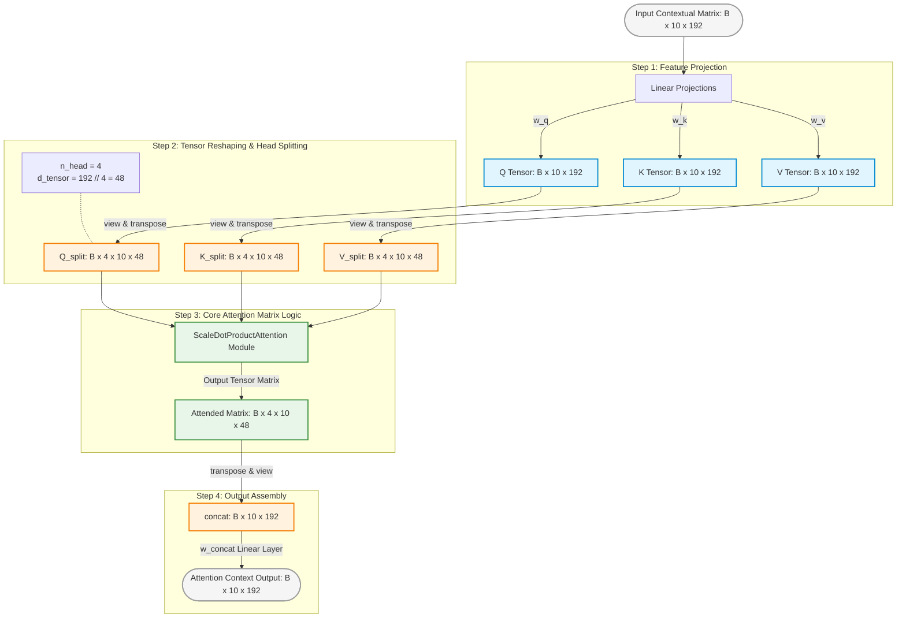
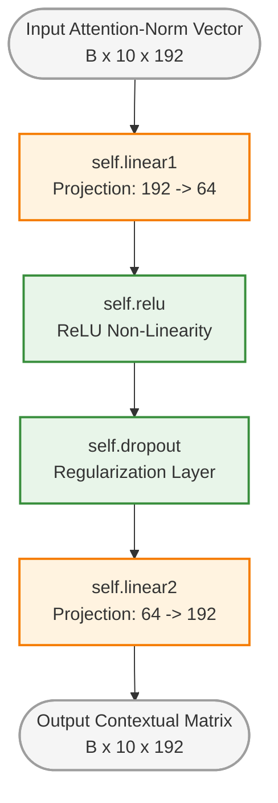

These three foundational blocks form the algorithmic core of your temporal `EncoderLayer`. They govern how your model processes cross-frame relationships over the tracking sequence and maps those associations into updated spatiotemporal representations.

Here are the structural and mathematical component diagrams for your EUSIPCO poster.

---

### Diagram 1: Multi-Head Self-Attention Pipeline (`MultiHeadAttention`)

This details how the spatial feature tracking sequences are linearly projected, structurally divided into distinct latent subspaces via the `split` method, and subsequently unified.



---

### Diagram 2: Internal Matrix Math of the Scaled Dot-Product Attention

This highlights the algebraic core inside `ScaleDotProductAttention`, verifying your tensor manipulations step-by-step.

```mermaid
graph LR
    %% Styling
    classDef tensor fill:#fafafa,stroke:#616161,stroke-width:2px;
    classDef math fill:#fffde7,stroke:#fbc02d,stroke-width:2px;

    Q([Q: B x 4 x 10 x 48]):::tensor --> MatMul((@))
    K([K: B x 4 x 10 x 48]):::tensor -->|transpose 2, 3| KT([K_t: B x 4 x 48 x 10]):::tensor
    KT --> MatMul
    
    MatMul -->|Raw Score Matrix| Div((/))
    Scale[sqrt d_tensor <br/> sqrt 48]:::math --> Div
    
    Div -->|Scaled Scores| MaskCheck{Is Mask <br/> Provided?}
    MaskCheck -->|No / None| Softmax[Softmax Layer <br/> dim=-1]:::math
    MaskCheck -->|Yes| MaskOp[masked_fill <br/> 0 -> -10000] --> Softmax
    
    Softmax -->|Attention Map Weights <br/> Shape: B x 4 x 10 x 10| ValueMatMul((@))
    V([V: B x 4 x 10 x 48]):::tensor --> ValueMatMul
    
    ValueMatMul --> FinalV([Output Context Matrix v <br/> Shape: B x 4 x 10 x 48]):::tensor

```

---

### Diagram 3: Positionwise Feed-Forward Network Block (`PositionwiseFeedForward`)

This details your non-linear transformation step ($FFN(x) = \max(0, xW_1 + b_1)W_2 + b_2$).



---

### 📊 EUSIPCO Poster Text & Equation Formatting

To ensure your math presentation satisfies the signal processing committee, formalize the mechanisms in your poster's technical column using these exact equations:

#### 1. Scaled Dot-Product Formulation

Given your split subspace projections $Q, K, V \in \mathbb{R}^{B \times 4 \times 10 \times 48}$, the attention map is evaluated as:

$$\text{Attention}(Q, K, V) = \text{softmax}\left(\frac{Q K^T}{\sqrt{d_{\text{tensor}}}}\right)V$$

#### 2. Positionwise Structural Expansion

Your bottleneck FFN processes each temporal index position identically and independently using a compressed projection subspace ($d_{\text{ffn}} = 64$):

$$\text{FFN}(x) = \max(0, xW_1 + b_1)W_2 + b_2$$

* **Subspace Efficiency Note:** In standard language transformers, the inner hidden layer dimension conventionally scales up to $4 \times d_{\text{model}}$. For your tracking task, however, your script scales **down** from $d_{\text{model}}=192$ to $\text{hidden}=64$. Explicitly state on your poster that this compression acts as an intentional low-rank feature bottleneck, forcing the model to retain only the most critical spatiotemporal motion states and effectively regularizing it against overfitting.