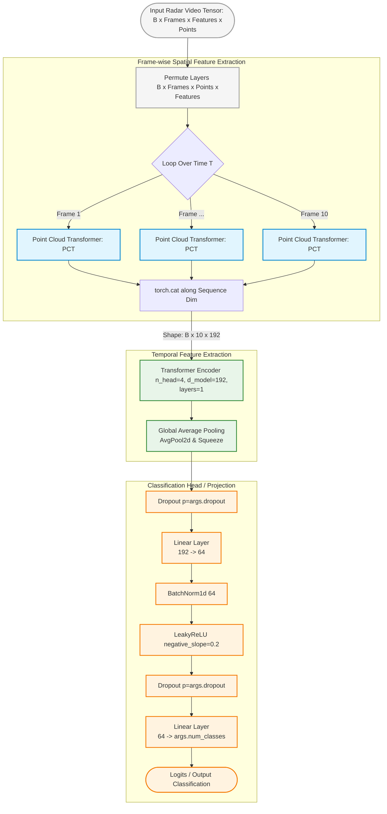
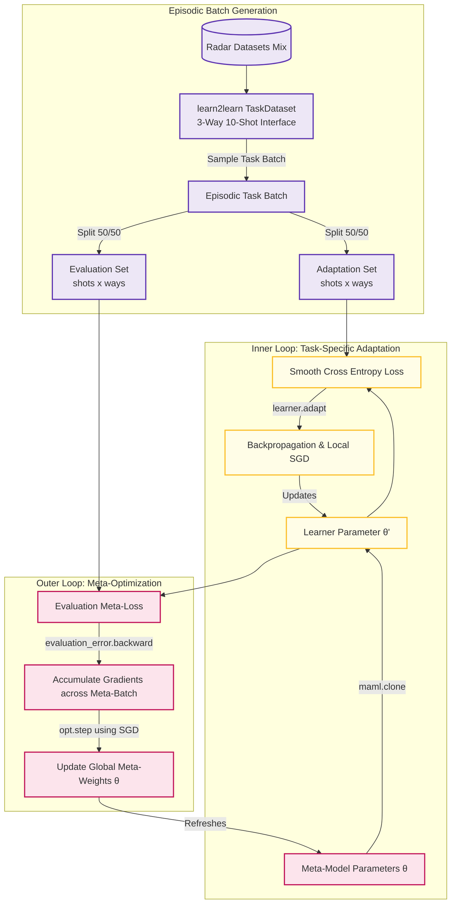

For an academic conference poster like EUSIPCO, you need two distinct types of diagrams:

1. **The Model Architecture Diagram:** Explaining how frame-wise point cloud data passes through the spatial PCT and temporal Transformer encoder.
2. **The Optimization/Training Flow Diagram:** Explaining the MAML meta-learning episodic setup (Inner Loop Task Adaptation vs. Outer Loop Meta-Update).

Here are the custom Mermaid scripts generated directly from your code structure.

---

### Diagram 1: The `PCT_Transformer` Architecture

This maps out your neural network design. It details the permutation, the temporal frame loop parsing into the `PCT` block, sequence reconstruction, and downstream classification blocks.

---

### Diagram 2: The MAML Episodic Meta-Learning Pipeline

This diagram explains your `fast_adapt` function and `main` training loop block, showing how the support and query setups feed your optimization loops.

---

### 💡 Academic Presentation Tips for EUSIPCO:

* **Vector Quality:** Do not use rasterized (.png/.jpg) screenshots of diagrams for a giant print poster. Copy these codes into a renderer tool (like `mermaid.live`) and export them as an **SVG** file. SVGs maintain perfect vector sharpness at A0 print scales.
* **Colors matching text:** Match the colors of your text headers on the poster to the background blocks of your architecture (e.g., if you talk about "Spatial Point Cloud Embeddings" in your methods section, give that text box the same light blue tint used in the diagram).

Whenever you are ready, go ahead and drop `point_cloud_transformer.py`! I can parse its sub-modules to break down the interior mechanisms of that block.