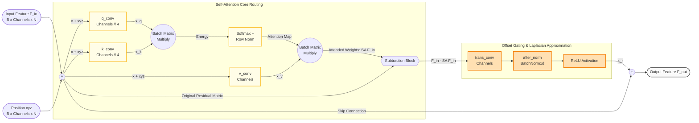

This is an elegant module layout. Your `PCT` implementation combines **Point Embedding** (via 1D convolutions), **Hierarchical Neighbor Embedding** (using a progressive `sample_and_group` operation with your custom `Local_op`), and an advanced **Offset Attention Layer (`SA_Layer`)** that replicates a graph Laplacian operator inside a `Point_Transformer_Last` block.

For an EUSIPCO conference poster, reviewers will look carefully at your **Hierarchical Neighbor Embedding** and the exact mathematical formulation of your **Offset Attention (OA)** block.

Here are the custom, structural component diagrams matching this script.

---

### Diagram 1: Detailed Internal Architecture of the `PCT` Module

This details the dual-stage abstraction pipeline (`Local_op` sampling stages) feeding into the Offset Attention framework.

```mermaid
graph TD
    %% Styling
    classDef io fill:#f5f5f5,stroke:#9e9e9e,stroke-width:2px;
    classDef embedding fill:#e1f5fe,stroke:#0288d1,stroke-width:2px;
    classDef local fill:#e8f5e9,stroke:#388e3c,stroke-width:2px;
    classDef attention fill:#fff3e0,stroke:#f57c00,stroke-width:2px;
    classDef head fill:#fce4ec,stroke:#c2185b,stroke-width:2px;

    In([Input Frame Frame Tensor <br/> B x Points x 3]):::io --> Conv1[Conv1d 3 -> 64 <br/> BN1 + ReLU]:::embedding
    Conv1 --> Conv2[Conv1d 64 -> 64 <br/> BN2 + ReLU]:::embedding
    
    subgraph NeighborEmbed [Hierarchical Neighbor Embedding Stage]
        Conv2 -->|Permute & Sample| SG1[sample_and_group <br/> npoint=150, radius=0.1]:::local
        SG1 --> LocOp1[Local_op 0 <br/> in=128 -> out=128]:::local
        LocOp1 -->|Permute & Sample| SG2[sample_and_group <br/> npoint=75, radius=0.1]:::local
        SG2 --> LocOp2[Local_op 1 <br/> in=256 -> out=256]:::local
    end

    subgraph AttnStage [Point Transformer Last Stage]
        LocOp2 -->|feature_1| PTLast[Point_Transformer_Last]:::attention
        PTLast -->|Concatenated SAs <br/> Shape: B x 1024 x N| Cat[torch.cat with feature_1]:::attention
        Cat -->|Shape: B x 1280 x N| ConvFuse[conv_fuse <br/> Conv1d 1280 -> 1024 + BN + LeakyReLU]:::attention
    end

    subgraph OutputDecoder [Feature Aggregation & Decoder]
        ConvFuse --> MaxPool[Adaptive Max Pooling 1D]:::head
        MaxPool -->|Flatten: B x 1024| Lin1[Linear 1024 -> 512 <br/> BN + LeakyReLU + Dropout]:::head
        Lin1 --> Lin2[Linear 512 -> 192 <br/> BN + LeakyReLU + Dropout]:::head
        Lin2 --> Lin3[Linear 192 -> output_channels 192 -> 7]:::head
        Lin3 --> Out([Output Local Frame Representation]):::io
    end

```

---

### Diagram 2: The Offset Attention (`SA_Layer`) Mechanism

This block clearly diagrams your custom Offset Attention math formulation ($F_{out} = \text{ReLU}(\text{BN}(\text{TransConv}(F_{in} - \text{SA}(F_{in})))) + F_{in}$), mapping your comment description of imitating a Graph Laplacian Matrix ($L = I - A$).

---

### 📝 Strategic Tips for your Poster's Methodology Text:

* **The Laplacian Connection:** Highlight the mathematical identity shown in your comments regarding the `SA_Layer`. Expressing that your Offset Attention architecture behaves closely to an implicit Laplacian feature map ($(I - A)F_{in} = L \cdot F_{in}$) is a highly valued point for an electrical engineering and signal processing audience like EUSIPCO.
* **Dimensional Context:** In your block layouts, denote the pooling setup explicitly (`AdaptiveMaxPooling1d`), as max-pooling point features down into dynamic permutation-invariant descriptors ensures your model remains translation and rotation resilient over radar trajectories.