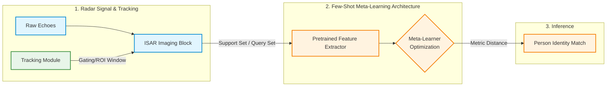

That sounds like an incredibly strong paper for **EUSIPCO** (European Signal Processing Conference)! Combining tracking-integrated Inverse Synthetic Aperture Radar (ISAR) with pretrained meta-learning for few-shot person identification is a complex pipeline that *absolutely* needs high-impact visual diagrams to succeed on an A0 portrait poster.

Because conference poster spaces are crowded and people skim quickly from a distance, your diagrams need a highly professional layout that balances signal processing steps (ISAR data, tracking) with deep learning components (meta-learning loops).

### 1. The High-Level Diagram Style (For a Poster)

For a signal processing/ML poster, you usually want to show the pipeline from physical world data to the final metric space. I can write the code to render a **Pipeline Flowchart** like this:

### 2. How to Proceed

To translate your work into custom, poster-ready structural blocks (like specific layer sizes, support/query splits, meta-update loops), please paste the core components of your Python script.

**What you can share:**

* Your PyTorch/Keras class definition for the **Feature Extractor / Backbone** (e.g., a custom CNN or ResNet variant processing the ISAR frames).
* The block of code managing the **Few-Shot / Meta-Learning logic** (e.g., episodic batching, Prototypical Network distance calculations, or MAML step updates).

Drop the code below, and I will generate the clean, block-based structural diagrams you need to drop straight into your poster design software!