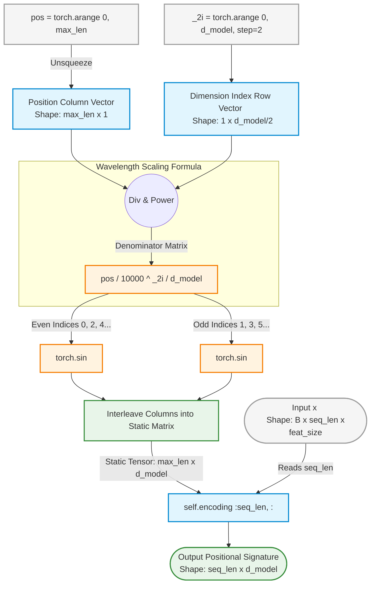

This code implements the classic fixed sinusoidal positional encoding strategy originally introduced by Vaswani et al. It generates a deterministic lookup matrix where even feature indices follow a sine wave function and odd feature indices follow a cosine wave function.

Because standard self-attention mechanisms contain no inherent sense of sequence order (they process inputs as a permutation-invariant bag of features), this block creates unique geometric coordinate signatures. When added to your features, it allows the model to differentiate between frame 1 and frame 10 in your tracking window.

---

### Diagram: Sinusoidal Coordinate Mapping

This diagram maps out the tensor operations that translate simple integer indexes (`pos` and `_2i`) into a static coordinate grid matching your temporal feature space ($10 \times 192$).

---

### 📊 Mathematical Insights for your EUSIPCO Poster

Reviewers from a signal processing background (like the EUSIPCO community) will appreciate seeing the explicit equation that describes this operation. You should present the encoding mathematically on your poster as follows:

For a frame position $t \in [1, N_{\max}]$ and a feature dimension index $j \in [1, d_{\text{model}}]$:

$$\text{PE}_{(t, 2i)} = \sin\left(\frac{t}{10000^{\frac{2i}{d_{\text{model}}}}}\right)$$

$$\text{PE}_{(t, 2i+1)} = \cos\left(\frac{t}{10000^{\frac{2i}{d_{\text{model}}}}}\right)$$

* **Why this works for radar tracking:** The geometric frequencies vary monotonically across the feature dimension $d_{\text{model}}$. This creates a continuous phase-space trajectory that allows the Transformer encoder to measure relative temporal distances between radar frames via linear transformations.
* **Zero-Gradient Efficiency:** Because `requires_grad = False`, this module adds temporal awareness without increasing the parameter count of your meta-learner, keeping the few-shot optimization pipeline lightweight and fast.