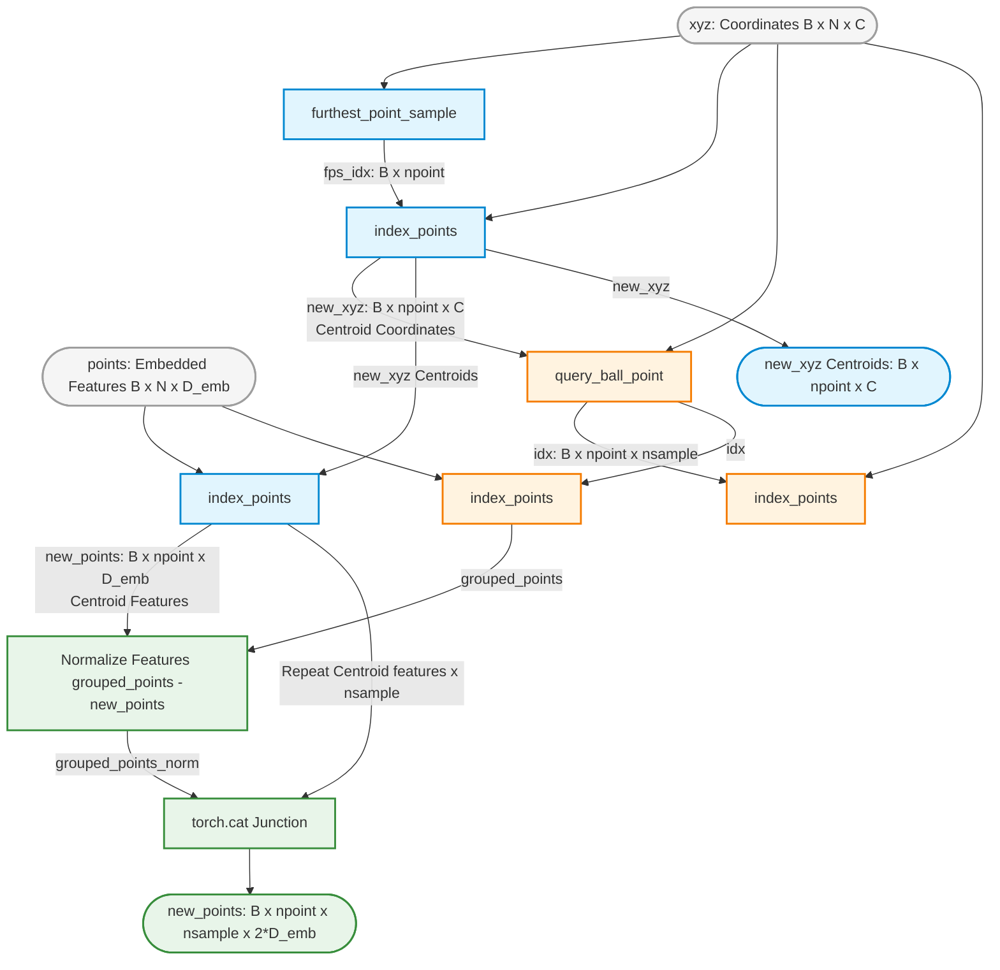

These two utility scripts manage the data preparation pipelines for your network: geometric grouping within your PCT framework and regularized loss computation during meta-learning optimization.

---

### Diagram 1: Spatial Neighborhood Grouping Pipeline (`sample_and_group`)

This schematic breaks down how raw unstructured input point frames ($[B, N, C]$) are subset into local clusters using Furthest Point Sampling (FPS) and Ball Query selection.



---

### Diagram 2: Label-Smoothed Cross Entropy Loss Math Pipeline

This highlights how your `smooth_cross_entropy` function regularizes training. By softening target confidence from $1.0$ down to $1.0 - \epsilon$, it prevents logit saturation and over-confident predictions across your episodic few-shot sets.

```mermaid
graph LR
    %% Styling
    classDef input fill:#fafafa,stroke:#616161,stroke-width:2px;
    classDef math fill:#fffde7,stroke:#fbc02d,stroke-width:2px;
    classDef out fill:#ffebee,stroke:#c62828,stroke-width:2px;

    Gold([Gold Labels: B]):::input --> OneHot[One-Hot Matrix <br/> B x n_class]:::math
    
    subgraph SmoothDist [Probability Mass Distribution]
        OneHot -->|True Class: * 1 - eps| Mix((+))
        OneHot -->|False Classes: 1 - one_hot| Dist[eps / n_class - 1]:::math
        Dist --> Mix
    end
    
    Pred([Predicted Logits: B x n_class]):::input --> LogSoftmax[F.log_softmax]:::math
    
    Mix -->|Smoothed Targets y_hat| LossMul((@ Vector Dot))
    LogSoftmax -->|Log-Probabilities log p| LossMul
    
    LossMul --> Sum[sum over classes]:::math
    Sum --> Mean[mean over batch]:::math
    Mean --> Neg[- Negative Inverse]:::math
    Neg --> LossOut([Final Loss Scalar]):::out

```

---

### 📊 Methodological Notes for Your Poster

* **Relative Coordinate Invariance:** In `sample_and_group`, your code explicitly normalizes points by subtracting the centroid positions: `grouped_xyz - new_xyz.view(...)`. Emphasize on your poster that this centers each neighborhood cluster at the origin $(0,0,0)$, forcing the downstream spatial `Local_op` convolutional heads to learn geometric local point shapes independently of their absolute spatial coordinates.
* **Regularizing Limited Datasets:** Label smoothing ($\epsilon = 0.2$) is highly advantageous for few-shot meta-learning. By limiting maximum target logit confidence, it prevents the model from generating extreme gradients during few-shot classification updates, making the optimization surface significantly more stable.