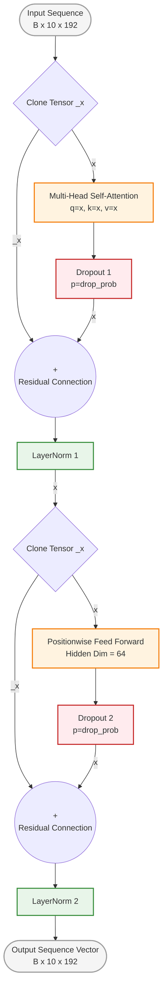

This `EncoderLayer` code implements the classic Transformer block architecture using a Post-Layer Normalization (Post-LN) scheme. It cleanly manages the dual-sublayer layout: the Multi-Head Self-Attention sublayer and the Positionwise Feed-Forward Network (FFN) sublayer.

For your EUSIPCO conference poster, mapping the precise execution flow of these residual paths (`x + _x`), dropout steps, and normalization components is critical to demonstrating how you preserve gradients through the deep temporal layer.

---

### Diagram: Detailed Architecture of the `EncoderLayer` Block

This diagram captures your step-by-step tensor routing, showing where cloning (`_x = x`), operations, dropouts, and residual additions occur.

---

### 💡 Poster Content & Discussion Tip

* **Post-LN vs. Pre-LN:** Your script implements classic **Post-LN** (where LayerNorm is applied *after* adding the residual connection: `self.norm1(x + _x)`). In your poster presentation or discussion, if a reviewer asks about training stability, you can note that since your temporal encoder is a highly focused $N=1$ layer network (`n_layers=1` in `main.py`), Post-LN provides excellent representational capacity without suffering from the vanishing/exploding gradient constraints often found in deeply stacked (e.g., 12+ layers) architectures.
* **Parameter Sizing:** Explicitly display the compact parameters on the poster layout text: $d_{\text{model}} = 192$, $d_{\text{ffn}} = 64$, and $\text{heads} = 4$. Showing this lean design proves you have tailored the capacity specifically for high-rate episodic radar sample constraints, preventing overfitting on your few-shot tracking classes.