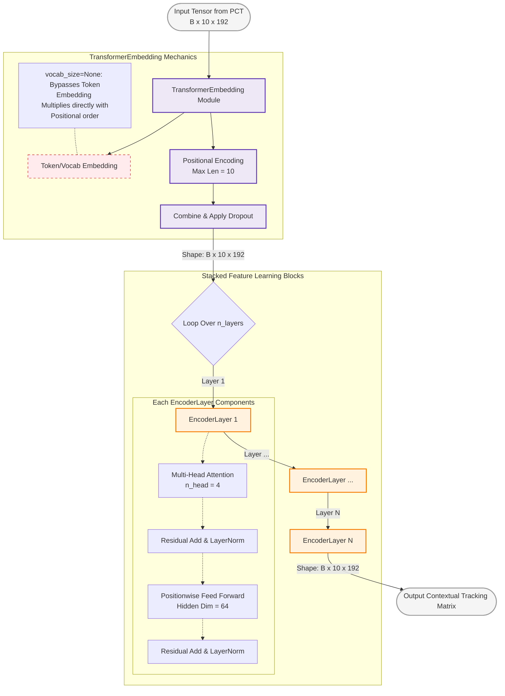

This `Encoder` script explicitly completes your temporal processing layer block. Your code comments reveal a critical detail for your EUSIPCO paper: `vocab_size` is evaluated as `None` in `main.py` because you are bypassing token/word text embedding. Instead, your frame-wise output features from the `PCT` act directly as your spatial embeddings, meaning `TransformerEmbedding` is strictly applying **Positional Encoding** and dropout to preserve the temporal tracking sequence order.

Here is the structurally complete block diagram detailing the internal mechanics of your temporal `Encoder` stage.

---

### Diagram: Internal Architecture of the `Encoder` Module

This details the embedding bypass logic and the iterative module loop handling your stacked `EncoderLayer` sub-modules.

---

### 📝 Strategic Technical Insight for Your Poster:

Because your inputs represent continuous physical tracking measurements from radar frames rather than discrete NLP language variables, emphasize in your architectural methodology section that:

1. **Feature Alignment:** The continuous point cloud structural features extracted via your spatial `PCT` framework align directly with the temporal transformer matrix space without requiring quantization matrices.
2. **Positional Injection:** The positional encoding step is vital because standard self-attention blocks are permutation invariant; injecting the sinusoidal coordinate markers guarantees that your meta-learner recognizes the true temporal chronographical trajectory of the target's movement.