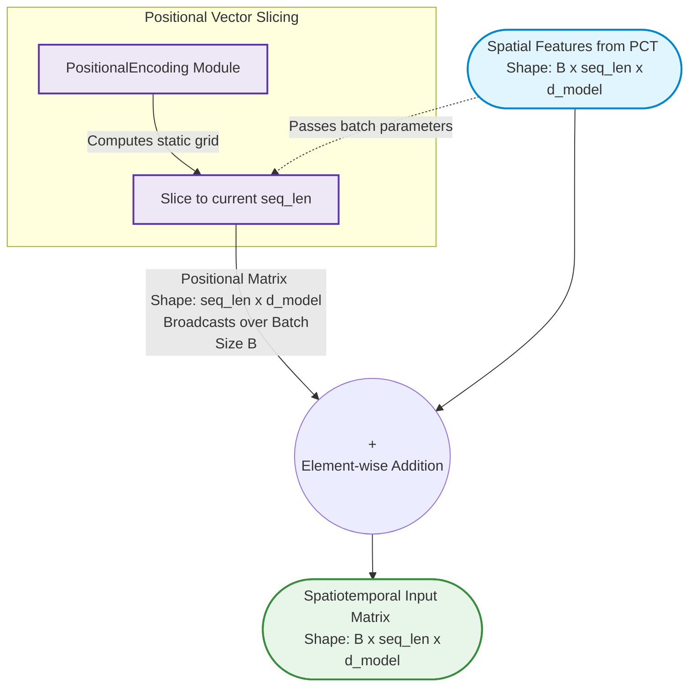

This `TransformerEmbedding` script acts as the structural gateway to your temporal processing backend. As noted in your comments and corroborated by your code structure, **the traditional discrete word/token embedding lookup is entirely discarded** (the `vocab_size` parameter is ignored in the execution block). Instead, the raw spatial feature vectors produced by the `PCT` ($x$) serve directly as continuous feature embeddings, which are then combined element-wise with the static sinusoidal coordinate signatures.

---

### Diagram: Unified Embedding Addition Block

This diagram visualizes how the continuous frame features and static geometric phase vectors merge into a single spatiotemporal sequence matrix.

---

### 📝 Strategic Methodological Takeaways for Your Poster

* **Continuous Feature Space vs. Discrete Tokenization:** Standard NLP Transformer models require a discrete embedding layer (`nn.Embedding`) to map token integers into continuous vectors. For an EUSIPCO audience, make sure to highlight that your framework preserves the **exact spatial geometric properties of physical point cloud frames** by feeding the raw output tensor of the `PCT` straight into this addition junction.
* **Broadcasting Invariance:** Because the positional encoding matrix lacks a batch dimension ($\text{seq\_len} \times d_{\text{model}}$), PyTorch implicitly broadcasts it across all $B$ sequences in the mini-batch during the `x + pos_emb` operations. This ensures that temporal indexing remains consistent across all tracks without incurring unnecessary memory consumption.